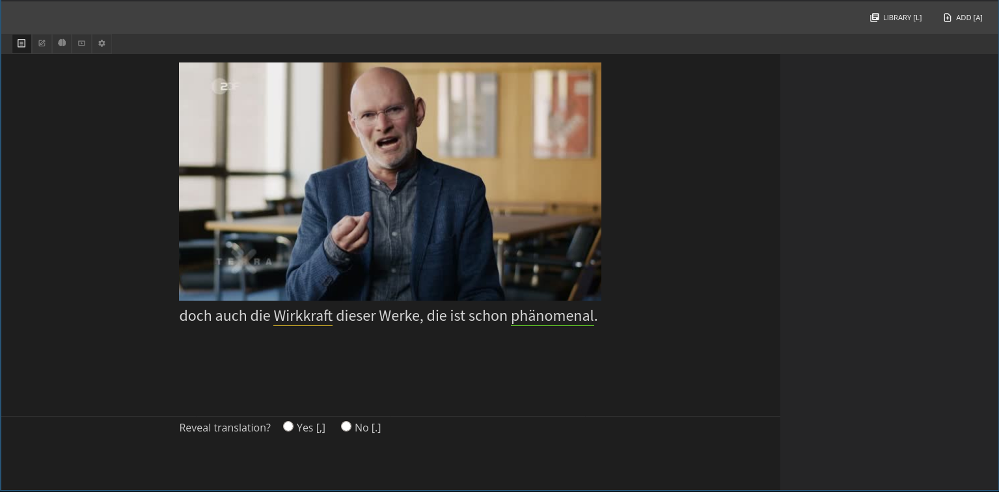
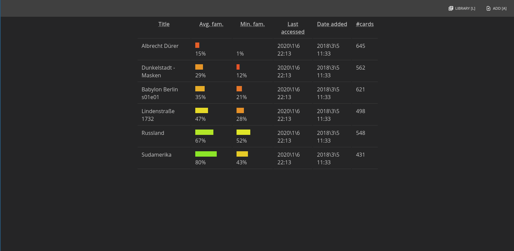

## About

Munnin is a tool to aid in text-driven language-learning. So far, I am only implementing the ability to work with subtitles and videos (similar to Fluentu).

This is not yet a functioning app, only a mockup with some components to aid in conceptualizing architecture and features.

There are so far three main scenes: Library, Add and Reader. The reader is only designed to work with a very specific type of text (subtitles). Different texts (e.g. e-books, news articles) will require different readers because there ae different things one would like to do with such texts.

## Screenshots

The study view within the reader:

Library view displaying the familiarity with different texts:

## Motivation

Munnin specifically addresses the following problems that I have encountered trying to learn languages with software:

**Problem: SRS scheduling solutions are too rigid**

Existing SRS solutions use a stateless projective scheduling algorithm. That is, they will look at how well your memory worked last time, and will then schedule your next review.

Although a great idea in theory, in practice this is a very rigid regime with limited practicality. What happens when a student has free time at intervals different to what the algorithm expects (e.g. more time on the weekends)? Or what about wanting to strengthen only vocabulary for specific areas (e.g. before a test?)

**Solution: A retrospective SRS algorithm**

Munnin does not use a scheduling algorithm at all. 

Instead, Munnin estimates how likely you are to forget each of the words you are learning at a given time using a supervised learning algorithm. Within Munnin this is known as the "familiarity". The algorithm then presents this metric to the user and has different card order options depending on what the user wants to do. Munnin is designed to empower users and treat them like adults, not like slaves of some know-it-all algorithm.

**Problem: No good way of automating flashcard creation from language exposure**

There is no reasonable way in programs such as Anki or Memrise to efficiently automate the creation of high-quality flashcards from texts. Let me explain:

1. It is possible to create flashcards from subtitles with minimal effort. Programs like SubtitleMemorize automate mapping captions to flashcards. Subtitle flashcards are excellent learning material: they have text, audio, images and the user's task is very clear (do you know what they are saying?). The downside is that there are around 700 cards per hour of video, most of which will be known for an intermediate or advanced learner - a lot of useless review work. 

2. It is also possible to simply export words from software like LWT or LingQ. This approach is in my experience, a nightmare from an effective learning perspective. It rests on two faulty assumptions: that a word is something that can be concisely and completely defined and that a word is something that can be learnt. Words tend to have many uses, and often appear in collocation with other words, which is why there are mountains of research showing that memorizing word lists is an inefficient way of acquiring vocabulary. Furthermore, it is not clear what 'learning a word' means. Is it just passive recognition? Knowing how to use it? Knowing every collocation? 

Learning a word is therefore too complex to fit in a flashcard, not to mention basically impossible to automate, since word flashcards tend to require constant tweaking and expansion. In this sense, studying vocabulary in the context of a chunk of text is much better.

**Solution: Using data to filter incoming flashcards**

So basically what we would like is something like what we have with subtitle cards, but with the ability to efficiently discard the fluff. Munnin filters new cards in two phases like this:

1. An advanced learner that has been using Munnin for a while will have a rather large table of known words within the system (same as LingQ and LWT). Upon loading a pair of subtitles, the system can immediately discard cards where all vocabulary is already known by simply parsing the text and looking up words in its known table. 
2. After the first filtering phase, the system produces a sequence of cards which prioritizes cards with new words. The user can quickly discard these cards or mark some words as 'learning' words (which are stored elsewhere and on which progress is tracked). This will have an effect on the rest of the sequence, which will be dynamically reassessed.

So after importing the subtitles and working through a dozen or so flashcards, an advanced learner will have greatly reduced the number of flashcards to study.

**Bonus: Video player**

Munnin embeds a video player for watching videos with subtitles in both languages (target is presented and translation can be easily shown with a key press). These timestamps are recorded by Munnin and can be used later. For example, review sessions can be done only on the captions where the video was stopped.
